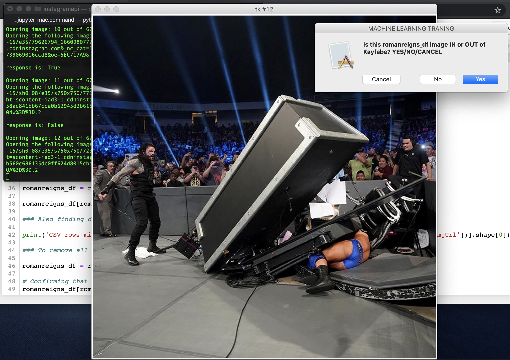

# AWS SageMaker example for ML Kayfabe Detector for Instagram photos

Etienne P Jacquot - 04/27/2021

This project was started in 2019 when Annenberg School for Communication faculty member Dr Lingel brought to our attention that there is interest in *using machine learning tools on social media content*.


## Getting Started w/ Kayfabe ML Training

You need access to AWS SageMaker, either via your own account or via Pennkey ASC account https://aws.cloud.upenn.edu/. 

- For this project you will need access to SageMaker & S3 bucket for your training & testing split data... 

*Please be sure to run your resources and shut down when not in use! Otherwise you will be charged for idle resources...* 


## WWE SuperStar [Ronda Rousey](https://www.instagram.com/rondarousey/):

This example for ML model training is based on WWE SuperStar Ronda Rousey's public instagram page https://www.instagram.com/rondarousey/. 


### Pre-processing Steps (*manually done*):

- **SOCIAL MEDIA CONTENT** --> Using the free service [PhantomBuster](https://phantombuster.com/phantombuster?category=instagram) to get all instagram picture URLs for various WWE users (tested for Roman Reigns & Ronda Rousey though of course there are others!)

- **AI FOR IMAGE ANALYSIS** --> We then pass each image to [AWS Rekognition](https://aws.amazon.com/rekognition/) via Python-SDK to get detected objects & features with >95% confidence interval.

- **SUPERVISED LEARNING** --> I manually went through ~1,500 Ronda Rousey instagram images (chronological order going back in mid 2019) to code a binary value `YES` or `NO` on whether the photograph was in **KAYFABE**... This CSV data is saved in directory [wwe_instagram_data](./wwe_instagram_data)
    - *This is a whole thing in WWE that I wasn't really familiar with, but basically breaking kayfabe is like breaking the 4th wall / being out of character in WWE... For example, an instagram photo of a sick headslam is IN KAYFABE but a photo of eating breakfast with your family is NOT KAYFABE*
    - More info [here](https://en.wikipedia.org/wiki/Kayfabe) & [here](https://prowrestling.fandom.com/wiki/Kayfabe)


### Training & Deploying your model w/ XGBoost

- **RUN CODE HERE** --> [Annenberg_ML_Kayfabe_Training.ipynb](Annenberg_ML_Kayfabe_Training.ipynb) is a python notebook based on AWS SageMaker example for bank csv data w/ their marketplace offering XGBoost.

    - More info on AWS XGBoost example [here](https://docs.aws.amazon.com/sagemaker/latest/dg/xgboost.html)


### Determining the accuracy of your XGBoost trained model

Machine learning is an iterative step w/ hyperparameter fine tuning! Please note that this example does not really go into changing values, just follows the defaults for XGBoost...

- This will output a trained CSV [data/train04222021.csv](./data/train04222021.csv) file, you can ignore this for the most part... this gets used to generate the **Confusion Matrix** for the training & testing data. For example, on the most recent run I got a greater than 83% true positive result on my `kayfabe-detector` for a 70/30 row split *(1029, 415) (441, 415)* w/ 415 columns of Rekognition data 1/0 for >95% confidence
    

```
Overall Classification Rate: 83.9%

----------------------------------------
Predicted----> No Kayfabe      Kayfabe

Observed
No Kayfabe     85% (175)    17% (41)
Kayfabe         15% (30)     83% (195) 
```
_____________

### Concluding thoughts ...

While I was unable to scale up for millions of WWE Instagram public userfeed images, this project was a helpful introduction to:

- AWS microservices Rekog & SageMaker
- Instagram social media web scraping & analysis
- Principles of supervised ML model training
- Pitfalls of *not* starting a project w/ git for versioning
- Considerations on scaling up with containers / cloud resources


This project & notebook was used as a demonstration for ASC researchers for ongoing project --> https://github.com/jmparelman/SageMaker_DNMF

))